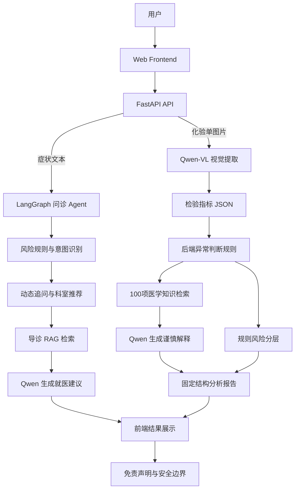
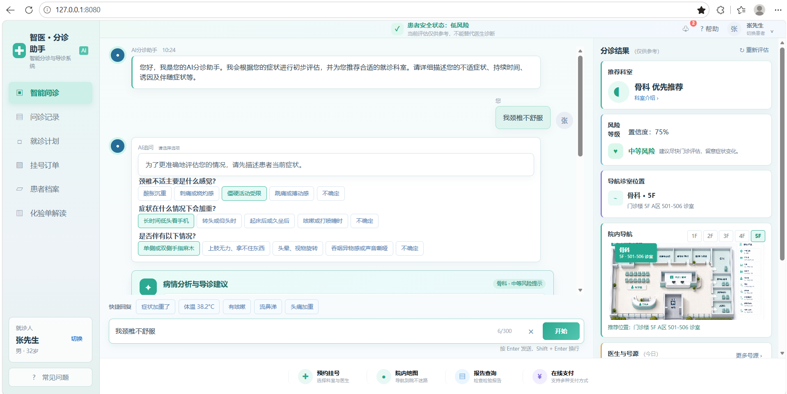
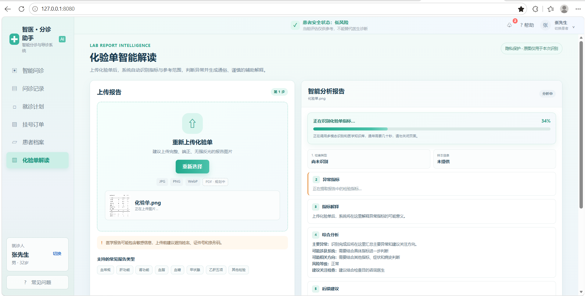
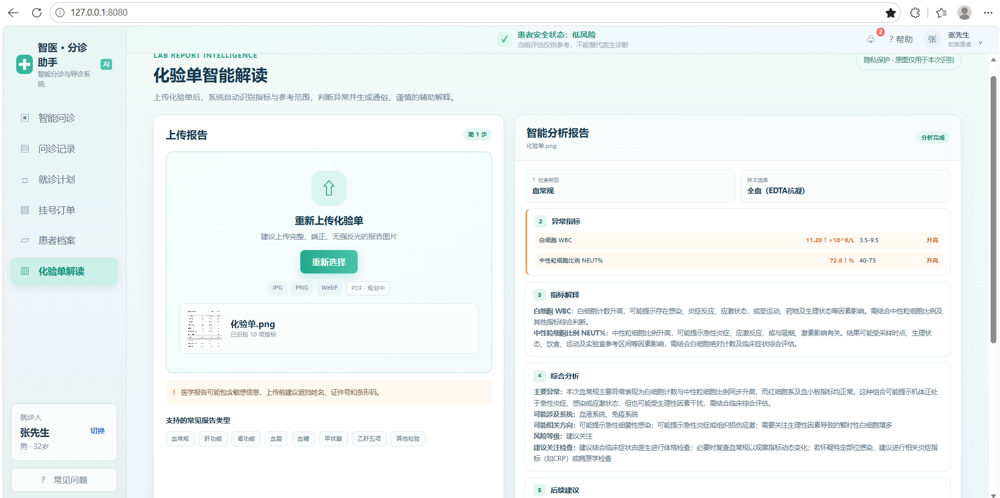
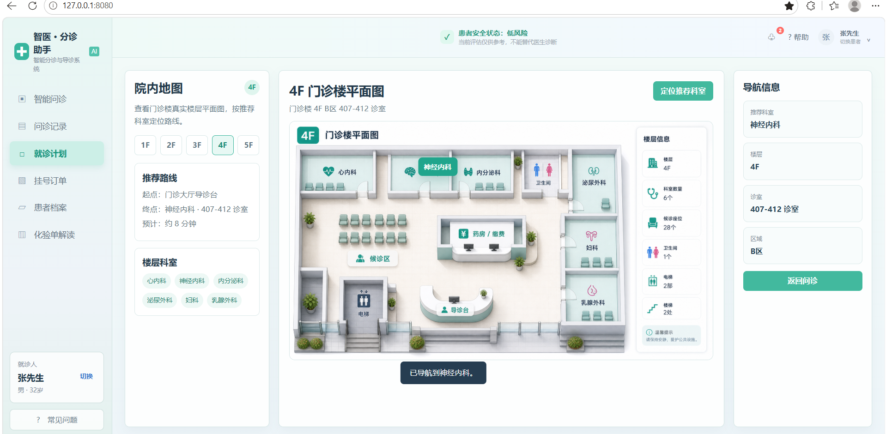

# MedicalAgent：多模态医疗问诊 Agent

> 同时理解**患者症状文本**与**化验单图片**，完成智能分诊、动态追问、检验指标结构化、异常规则判断、医学知识检索和谨慎解释。

MedicalAgent 是一个面向开源展示与工程实践的多模态医疗 Agent。项目不是将用户输入直接交给大模型自由回答，而是针对两类输入建立独立、可验证的处理链路：

- **文本问诊 Agent**：理解症状描述，通过 LangGraph 编排风险分级、动态追问、科室推荐和就医路径生成。
- **视觉化验单 Agent**：使用 Qwen 多模态模型读取化验单图片，提取指标 JSON，由后端规则判断异常，再结合100项本地医学知识生成解释报告。

项目通过 FastAPI 对外提供接口，并提供完整前端用于演示多轮问诊和化验单智能解读。所有医疗输出均保持谨慎表达，不直接诊断疾病、推荐药物或制定治疗方案。

## 项目亮点

- 文本与图像双模态输入，不是单一聊天机器人。
- LangGraph 编排多节点问诊 Agent，支持动态追问和会话状态。
- Qwen-VL 完成化验单视觉识别与结构化提取。
- 规则层独立判断指标高低，LLM 不能修改检验结果和异常状态。
- 100项常见检验指标知识库，为解释提供可追溯依据。
- 固定结构输出报告，包含异常指标、涉及系统、相关方向、风险等级和建议关注检查。
- 35项自动化测试、GitHub Actions 和12组导诊评估案例。

## 技术栈

- Python 3.12
- FastAPI / Uvicorn
- LangGraph / LangChain
- OpenAI 兼容接口，用于调用 Qwen 文本及多模态视觉模型
- ChromaDB / sentence-transformers，用于本地医学知识库检索
- SQLAlchemy / PyMySQL，用于可选的科室位置等结构化数据
- HTML / CSS / JavaScript，用于前端演示页面

## 核心功能

- 症状输入与意图识别：识别用户输入中的症状、部位、持续时间和就医诉求。
- 风险等级判断：根据胸痛、呼吸困难、意识异常、大量出血等高危信号给出 high / medium / low 风险等级。
- 科室推荐：结合规则、LLM 分析和兜底逻辑推荐合适科室。
- 动态追问：当症状信息不足时，生成一轮关键追问，补齐导诊所需信息。
- 就医路径推荐：返回科室位置、楼层区域、挂号流程和就诊准备建议。
- 化验单图片识别：支持从 JPG、PNG、WebP 图片中提取指标、结果、单位、参考范围和报告异常标记。
- 检验规则判断：后端根据原报告标记和参考范围确定 high / low / normal / critical，避免由 LLM 自行判断。
- 知识增强解释：检索100项本地医学知识，为异常指标、可能涉及系统和建议检查提供解释依据。
- 结构化分析报告：固定输出报告概览、异常指标、指标解释、综合分析、后续建议和医疗免责声明。
- 人工转接判断：识别高风险、低置信度或超出系统能力边界的问题，建议人工导诊或现场医护介入。

## 多模态处理流程

### 文本问诊链路

症状文本 → 意图识别 → 风险分级 → 动态追问 → 科室推荐 → RAG检索 → 就医路径与谨慎建议

### 化验单图像链路

化验单图片 → Qwen-VL视觉识别 → 指标JSON结构化 → 后端规则判断异常 → 医学知识检索 → Qwen谨慎解释 → 固定结构报告

这两条链路共享 FastAPI 服务和前端会话入口，但将关键规则与生成式解释分离：模型负责理解和表达，后端负责确定性校验与安全约束。

## 架构图



## 界面展示

### 多轮智能问诊

Agent 根据患者症状进行风险评估和动态追问，并在同一工作区展示推荐科室、置信度、院内位置及下一步建议。

[](docs/assets/screenshots/triage-agent.png)

### 多模态化验单解读

上传化验单图片后，页面持续展示视觉识别、异常判断、医学知识检索和解释生成进度；完成后输出固定结构的谨慎分析报告。

<table>
  <tr>
    <td width="50%" align="center">
      <a href="docs/assets/screenshots/lab-analysis-loading.png"></a><br>
      <sub>多模态识别与知识检索进度</sub>
    </td>
    <td width="50%" align="center">
      <a href="docs/assets/screenshots/lab-analysis-result.png"></a><br>
      <sub>异常指标与结构化综合分析</sub>
    </td>
  </tr>
</table>

### 就医路径与院内导航

问诊结果可继续衔接模拟挂号、就诊计划和楼层科室导航，形成从症状描述到就医路径的完整演示闭环。

[](docs/assets/screenshots/hospital-navigation.png)

## 目录结构

```text
MedicalAgent/
├── agent_core/          # LangGraph 流程、LLM 调用、提示词和结果结构
├── backend/             # FastAPI 后端入口
├── data/                # 医学知识文档和模拟医院地图数据
├── docs/                # 项目文档和报告
├── frontend/            # 静态前端演示页面
├── medical_knowledge/   # 100项检验指标知识文件及检索加载器
├── rag/                 # RAG 文档切分、向量库构建和检索
├── scripts/             # 辅助脚本和检查脚本
├── tools/               # 风险分级、科室推荐、追问、RAG、人工转接等工具
├── app.py               # 后端兼容入口，导出 backend.app
├── graph.py             # LangGraph 兼容入口，导出 agent_core.graph
├── main.py              # 最小命令行 demo 入口
├── medical_graph.py     # 导诊流程兼容入口
├── requirements.txt     # pip 依赖列表
└── langgraph.json       # LangGraph 本地运行配置
```

## 安装方式

```bash
python -m venv .venv
.venv\Scripts\activate
pip install -r requirements.txt
```

如需调用大模型，请在 `project_config/.env` 或根目录 `.env` 中配置：

```env
LLM_API_KEY=your_api_key
LLM_BASE_URL=https://dashscope.aliyuncs.com/compatible-mode/v1
LLM_MODEL=qwen-plus
LLM_VISION_MODEL=qwen3.7-plus
```

可复制仓库中的 `.env.example` 作为配置模板。请勿提交包含真实 Key 的 `.env` 文件。

### 化验单隐私说明

化验单图片会发送到你在 `LLM_BASE_URL` 中配置的模型服务进行识别和解释。请勿上传包含姓名、身份证号、手机号、住院号、条码等真实身份信息的报告；用于公开演示时应使用脱敏或模拟数据。

## 运行方式

Windows 用户可双击项目根目录的 `启动项目.cmd`。脚本会使用当前项目的 `.venv`，并启动：

- 前端：`http://127.0.0.1:8080/`
- 后端：`http://127.0.0.1:8000/`
- 接口文档：`http://127.0.0.1:8000/docs`

停止服务请双击 `停止项目.cmd`。如 8000 或 8080 被其他程序占用，启动脚本会停止并显示占用信息，不会启动第二套服务或误杀其他进程。

运行命令行最小 demo：

```bash
python main.py "我发烧咳嗽两天了，应该挂什么科？"
```

如需在终端单独启动后端，请先进入克隆后的项目目录：

```powershell
cd MedicalAgent
.venv\Scripts\python.exe -m uvicorn backend.app:app --host 127.0.0.1 --port 8000
```

访问接口文档：

```text
http://127.0.0.1:8000/docs
```

也可以单独启动前端：

```powershell
.venv\Scripts\python.exe -m http.server 8080 --bind 127.0.0.1 --directory frontend
```

Linux 和 macOS 请将虚拟环境解释器路径替换为 `.venv/bin/python`。

如需重建本地 RAG 向量库，可在服务启动后请求：

```bash
curl -X POST http://127.0.0.1:8000/build
```

运行单元测试：

```bash
python -m pytest -q
```

运行轻量导诊评测：

```bash
python scripts/evaluate_demo_cases.py --fail-under 1.0
```

使用 Docker 启动后端：

```bash
docker compose up --build
```

启动后访问：

```text
http://127.0.0.1:8000/docs
```

## 示例输入输出

推荐的项目演示顺序是：先用症状文本展示多轮问诊和动态追问，再上传一张脱敏化验单，展示视觉识别、进度反馈、异常规则判断、知识依据和结构化综合分析。

可以直接运行内置 demo：

```bash
python main.py --case all
```

### 示例一：普通感冒/咳嗽类低风险

输入：

```text
我咳嗽两天了，有点流鼻涕，没有胸痛，也没有呼吸困难，应该挂什么科？
```

示例输出：

```json
{
  "risk_level": "low",
  "recommended_department": "呼吸内科",
  "need_followup": true,
  "follow_up_questions": [
    "症状持续多久了？是否伴随发热、胸闷、呼吸困难或基础疾病？"
  ]
}
```

### 示例二：胃痛/发热类中风险

输入：

```text
我胃痛持续三天了，今天还有点发热和恶心，应该去哪个科？
```

示例输出：

```json
{
  "risk_level": "medium",
  "recommended_department": "消化内科",
  "need_followup": true,
  "visit_guide": "建议携带身份证、医保卡和既往检查资料，按医院挂号流程前往对应科室。"
}
```

### 示例三：胸痛/呼吸困难类高风险

输入：

```text
我突然胸痛，喘不上气，还有明显呼吸困难，现在应该怎么办？
```

示例输出：

```json
{
  "risk_level": "high",
  "recommended_department": "急诊科",
  "need_followup": false,
  "answer": "根据当前描述，建议优先考虑急诊科。该结果仅作为导诊参考。"
}
```

### 示例四：化验单图片智能解读

输入：一张已脱敏的血常规、肝功能、肾功能、尿常规、血脂血糖、甲状腺、感染、炎症、凝血、心肌或肿瘤标志物报告图片。

处理结果包含：

```json
{
  "report_type": "血常规",
  "abnormal_count": 1,
  "risk_level": "建议关注",
  "possible_systems": ["血液系统"],
  "possible_directions": ["可能提示与炎症反应相关，需要结合其他指标判断。"],
  "suggested_checks": ["建议关注血常规复查及白细胞分类计数。"],
  "disclaimer": "本分析仅用于辅助理解报告，不构成医疗诊断或治疗建议。"
}
```

检查类型并非直接采用报告标题。后端会过滤医院名称和“检验报告单”等通用抬头，并根据实际指标组合规范为血常规、肝功能、肾功能等受控类型。

说明：默认 `main.py` 使用轻量规则 demo，便于无 API Key 时快速展示；使用 `--full-agent` 会调用现有 LangGraph Agent 全流程，实际输出会受到规则、模型返回、知识库和本地配置影响。

## RAG 引用来源

完整 Agent 流程会保留 RAG 检索来源字段，便于前端或命令行展示回答参考依据：

```json
{
  "sources": ["科室说明.txt", "就诊流程.txt"],
  "source_details": [
    {
      "source": "科室说明.txt",
      "content": "呼吸内科主要处理咳嗽、发热、气促等呼吸系统相关问题..."
    }
  ]
}
```

这些字段来自 `rag/` 和 `tools/medical_rag_tool.py`，用于说明导诊建议参考了哪些本地知识文档。

## 设计亮点

- 采用文本问诊与视觉化验单两条 Agent 链路，在同一产品中完成多模态医疗信息理解。
- 使用 LangGraph 将导诊拆分为多个可观察节点，避免把风险判断、科室推荐和回答生成都堆在单次 LLM 调用中。
- 高风险症状优先走规则兜底，降低大模型漏判胸痛、呼吸困难、意识异常等情况的风险。
- 通过动态追问补齐关键信息，避免在症状描述不足时直接给出过度确定的建议。
- 化验单识别遵循“视觉提取 → JSON结构化 → 规则判断 → 知识检索 → LLM解释”，避免让模型直接决定异常状态。
- 100项Markdown医学知识与检索器解耦，可继续接入 embedding 与向量检索而不影响现有接口。
- 提供命令行 demo、前端页面、Docker 启动、GitHub Actions 单元测试和轻量评测集，方便面试官快速验证项目。

## 评测结果

项目提供 `eval/triage_eval_cases.json` 作为轻量导诊评测集，覆盖低风险、中风险、高风险、否定高危词和常见科室路由。当前评测结果：

| 指标 | 结果 |
| --- | --- |
| 样例数量 | 12 |
| 完全匹配率 | 100% |
| 风险等级准确率 | 100% |
| 科室推荐准确率 | 100% |
| 追问判断准确率 | 100% |

详细说明见 `docs/reports/evaluation_report.md`。

## 难点与解决方案

| 难点 | 解决方案 |
| --- | --- |
| 医疗导诊不能直接等同诊断 | 在 README、回答结果和 prompt 边界中明确“仅供学习研究和导诊参考”，高风险场景优先建议急诊或人工介入。 |
| 用户症状描述不完整 | 通过动态追问节点补充持续时间、伴随症状、基础疾病等关键信息。 |
| 大模型输出不稳定 | 将风险分级、科室推荐、人工转接等关键判断拆成工具和规则兜底，LLM 主要承担语义理解和补充分析。 |
| 开源展示容易混入本地隐私文件 | 使用 `.gitignore` 和 `.dockerignore` 排除 `.env`、日志、向量库、简历文档和生成产物。 |
| 面试官难以快速验证 | 提供 `examples/demo_cases.json`、`python main.py --case all` 和 `pytest` 测试入口。 |

## 后续优化方向

- 在现有图片化验单识别基础上补充 PDF 报告支持。
- 将现有确定性知识检索升级为 embedding + 向量检索，并建立离线召回评测集。
- 引入更多脱敏化验单样本，评估视觉提取、检查类型识别和异常判断准确率。
- 拆分前端大型脚本，进一步提升组件复用和长期维护性。
- 增加端到端测试，覆盖真实图片上传到固定报告生成的完整链路。

## 免责声明

本项目仅用于学习研究和工程实践展示，不能替代医生诊断、治疗建议或真实医院分诊结果。若出现胸痛、呼吸困难、意识异常、大量出血、严重外伤等高风险症状，请立即联系急救服务或前往急诊。

## 开源许可证

本项目采用 [MIT License](LICENSE) 开源。使用、修改或分发本项目时，请保留原版权声明和许可证文本。
